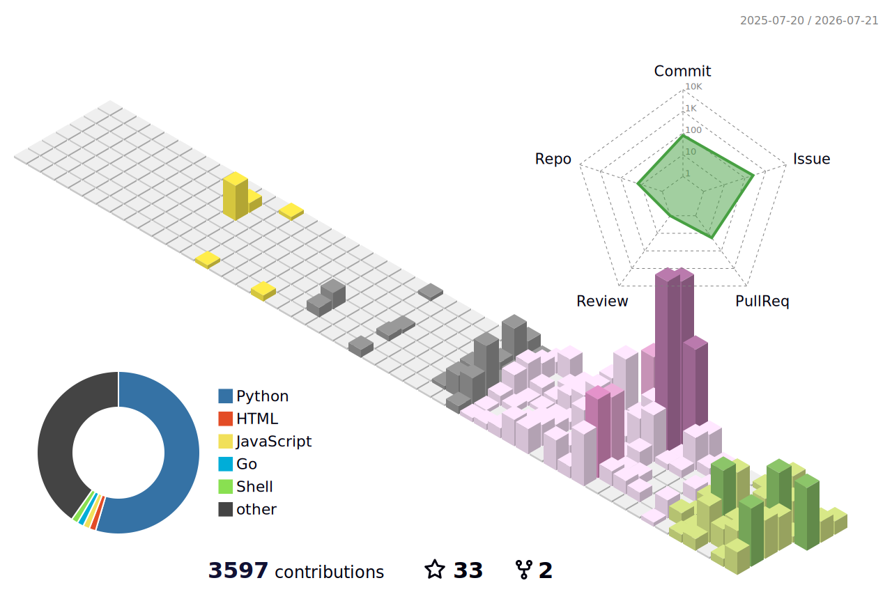

## ⚡ arsenal

## 📊 dashboard

<picture>
  <source media="(prefers-color-scheme: dark)" srcset="https://github-readme-stats.vercel.app/api?username=haskiindahouse&show_icons=true&include_all_commits=true&rank_icon=github&theme=tokyonight&hide_border=true&bg_color=00000000">
  <source media="(prefers-color-scheme: light)" srcset="https://github-readme-stats.vercel.app/api?username=haskiindahouse&show_icons=true&include_all_commits=true&rank_icon=github&hide_border=true">
  
</picture>
<picture>
  <source media="(prefers-color-scheme: dark)" srcset="https://github-readme-stats.vercel.app/api/top-langs/?username=haskiindahouse&layout=compact&langs_count=8&hide=html,css&theme=tokyonight&hide_border=true&bg_color=00000000">
  <source media="(prefers-color-scheme: light)" srcset="https://github-readme-stats.vercel.app/api/top-langs/?username=haskiindahouse&layout=compact&langs_count=8&hide=html,css&hide_border=true">
  
</picture>

<picture>
  <source media="(prefers-color-scheme: dark)" srcset="https://streak-stats.demolab.com?user=haskiindahouse&theme=tokyonight&hide_border=true&background=00000000">
  <source media="(prefers-color-scheme: light)" srcset="https://streak-stats.demolab.com?user=haskiindahouse&hide_border=true">
  
</picture>

<picture>
  <source media="(prefers-color-scheme: dark)" srcset="https://github-readme-activity-graph.vercel.app/graph?username=haskiindahouse&theme=tokyo-night&hide_border=true&area=true&radius=8">
  <source media="(prefers-color-scheme: light)" srcset="https://github-readme-activity-graph.vercel.app/graph?username=haskiindahouse&theme=github-compact&hide_border=true&area=true&radius=8">
  
</picture>

## 🐍 graph eaters

<picture>
  <source media="(prefers-color-scheme: dark)" srcset="https://raw.githubusercontent.com/haskiindahouse/haskiindahouse/output/github-contribution-grid-snake-dark.svg">
  <source media="(prefers-color-scheme: light)" srcset="https://raw.githubusercontent.com/haskiindahouse/haskiindahouse/output/github-contribution-grid-snake.svg">
  
</picture>

<picture>
  <source media="(prefers-color-scheme: dark)" srcset="./profile-3d-contrib/profile-night-rainbow.svg">
  <source media="(prefers-color-scheme: light)" srcset="./profile-3d-contrib/profile-season-animate.svg">
  
</picture>

## 🏹 flagships

